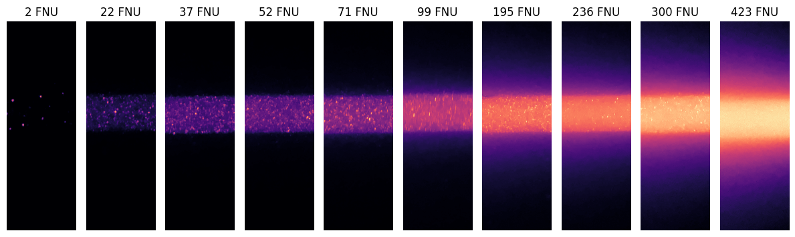
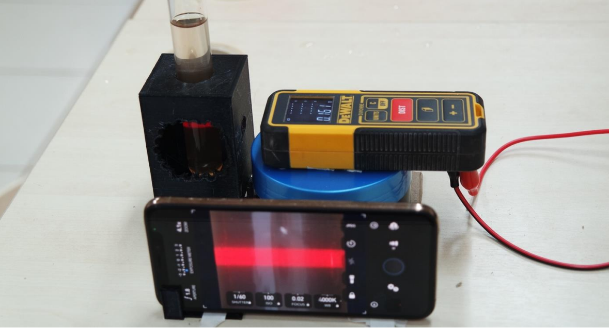

# Estimativa da Turbidez da Água por Meio do Processamento Digital de Imagens

Este repositório contém os arquivos relacionados à pesquisa realizada no âmbito de um Trabalho de Conclusão de Curso (TCC) de pós-graduação, com o objetivo de estimar a turbidez da água por meio do processamento digital de imagens.

## Descrição do Projeto

A turbidez da água é um parâmetro crítico em diversas aplicações, como monitoramento da qualidade da água e controle de processos industriais. Neste estudo, um método inovador de processamento digital de imagens foi desenvolvido para estimar a turbidez da água. O processo envolveu a criação de amostras de água com diferentes níveis de turbidez e a montagem de um aparato experimental para capturar imagens do feixe de laser enquanto atravessava as amostras.

## Conteúdo do Repositório

- **`/datasets/setup1` e `/datasets/setup2`**: Contém imagens de turbidez em diferentes concentrações (2, 22, 37, 52, 71, 99, 195, 236, 300, 423 FNU).

- **`/codigo_analise`**: Inclui o código utilizado na análise das imagens, o qual resultou no artigo da pesquisa.

- **`/documentacao`**: Documentação detalhada do processo experimental, incluindo a preparação das amostras, a montagem do aparato e as configurações utilizadas.

## Preparação de Amostras de Água e Montagem do Aparato Experimental

O processo de preparação das amostras de água e a montagem do aparato experimental são descritos em detalhes na documentação fornecida neste repositório.

## Resultados e Discussão

Neste estudo, foram exploradas duas metodologias de extração de características de imagem para medições de turbidez, com o objetivo de avaliar e comparar o desempenho de modelos de regressão na previsão dos valores de turbidez (FNU). Cada metodologia apresenta características únicas de processamento de imagem, o que permitiu uma análise mais aprofundada da influência das características extraídas nos resultados.

| Metodologia | Modelo                  | Dataset    | MSA     | R2 Score |
|-------------|-------------------------|------------|---------|----------|
| Ponto Central| Linear                | Treinamento| 34.140  | 0.890    |
| Ponto Central| Linear                | Teste      | 33.116  | 0.900    |
| Ponto Central| Polinomial (3º)       | Treinamento| 9.629   | 0.988    |
| Ponto Central| Polinomial (3º)       | Teste      | 10.741  | 0.985    |
| Espalhamento da Luz| Linear         | Treinamento| 6.487   | 0.995    |
| Espalhamento da Luz| Linear         | Teste      | 8.962   | 0.989    |

---

## Contribuições

Este trabalho pode servir como referência para pesquisadores interessados em estimar turbidez da água por meio de processamento de imagens. Sinta-se à vontade para explorar, clonar e contribuir para este repositório.

## Autores

- Marcos Vinicius Rocha da Silva

## Licença

Este projeto é licenciado sob a MIT.

---
